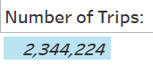
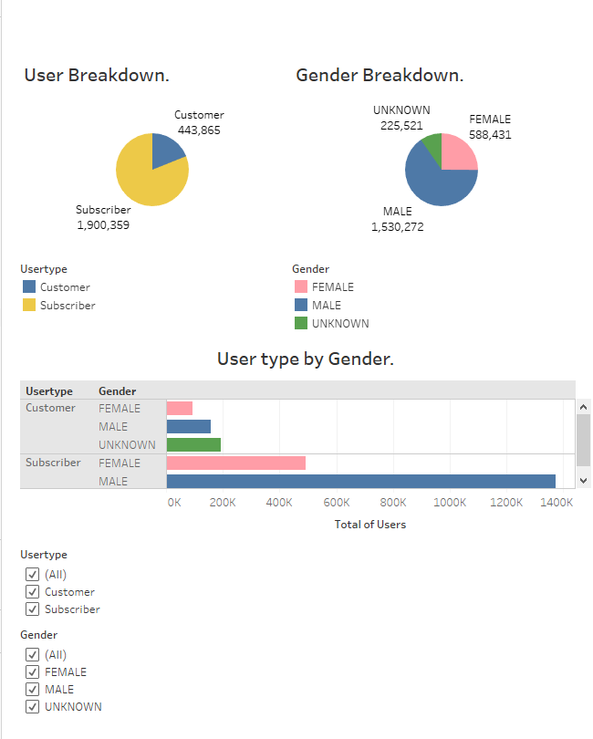
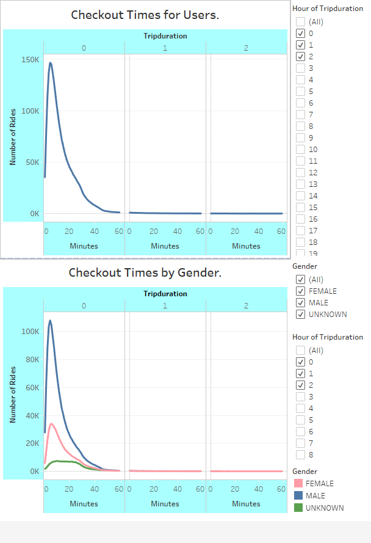
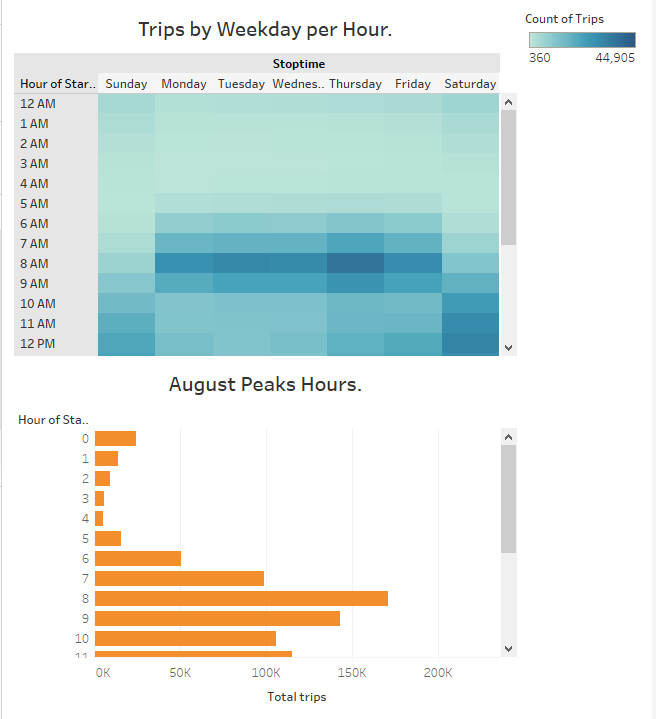
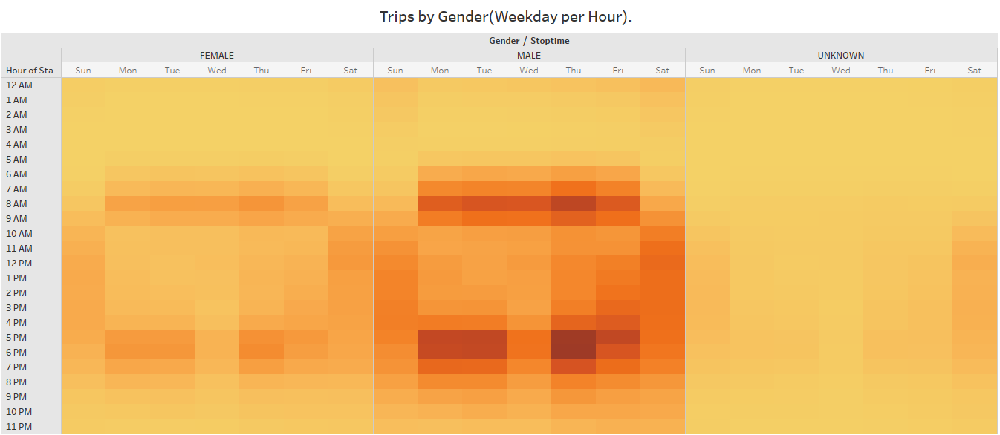
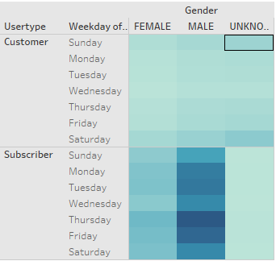

# Overview of Project:

Over the past decade, bike share has been one of the great U.S. transportation success stories. In fact, bike-sharing dramatically decreases traffic, reduces energy consumption, decreases harmful gas emissions, improves public health and promotes economic growth. 
In this project, we work on the implantation of this concept in the capital of Iowa Des-Moines. 
For this purpose we need to showcase some fundamental key metrics to investors. 
As a run test, we analyse data from New York city bike sharing company Citi-Bike, using data from the month of August 2019. Using data from a busy summer month will likely display some utilizable trends about traffic and activities for our own project. 
Keeping in mind that Des-Moines and New-York are quite different cities, our problematic is to find which data will or will not be relevant for our bike sharing project in Des-Moines.

# Results:

To present and ensure the viability of this project to our investors, couple questions have to be answered:
 
- Get an idea of the number of trips we could expect on a summer month. NYC had for August 2019, a count of 2.344.224 bike trips. That represented ~25% of the total population, and indicated that we could expect the same in Des-Moines. 

- Find proportions of short terms customers to annuals subscribers as well as genders of active riders.

Looking at the User Breakdown, we analyse that ~80% are the annual subscriber, and the ~20% left are one time customers, ~75% of total users are Male. 
We can also inspect that we have ~3 times more Male subscriber than Female. On another hand we are missing information about the Gender for the customer part.
We could then conclude that bike sharing is more use by Male subscriber's. 

- What is the average trip duration.

   
Looking over these graphs indicate that the average trip duration is ~5 minutes for all kind of users, the output is similar when we investigate by genders (~5 min for Male/ ~6 min for Female).
 
  

- Analyse of Trips by weekday allow us more insights.

 
At a glance, we study that during the week-end(Saturday/Sunday), trips are more condensed between 9am to 6pm. 
During the week-day(Monday through Friday), we have two distinct peak hours:
  - One in the morning 7am to 9am.
  - One in the evening 4pm to 7pm with a spike between 5pm and 6pm (except on Wednesday).
Bikes are used all week long, based on the hours to go and come back from work during week-day, and to enjoy outdoor activities on the week-end.

Analyse of trips by weekday per genders inform us that Male are the one using bike sharing the most on similar hours as the previous heat-map.    

The category with the most user is  Male and subscriber using bike sharing during week-day more particularly on Thursday and Friday.

- Analyse of bike utilization and repairs need.

We can pinpoint which bikes are more use than other and in function known which one are going to need repairs, we can also filter this graph by bike ID to do a more specific research on a particular bike.

# Summary:

More metrics could have been shown like the top starting and ending stations, but it is not that relevant for an implantation in Des-Moines because the geography of both cities are different, tourism activities as well.
 
At the light of this metrics research, couple conclusions can be drawn:

- User are more subscriber than one time customer.
- Trip duration average is ~5 minutes.  
- Most part of user are Male.
- Most of the trips activity are during week-day more particularly in the evening for work's transportation purpose. 

 
Business recommendations:

- Knowing that most user are Male let a window open for development to attract more Female into bike sharing(have some bike more adapted to Female can definitively help it).
- There is more user during the evening 4pm to 7pm on week-day, implanting bike stations around residential area could help boost the utilization for user to go to work in the morning with a bike as well. 
- There is user during the week-end but not as much as during the week-day peak hours, an only week-end subscribe policy might boost utilization during week-end. 
 

Some other visualizations for future analysis can be added to give more insights to our investors:
  
- Starting investment: how mush cost a bike and how many we will need to have enough during peak hours.
- An analysis of the difference user time checkout between week-day and week-end.
- An analysis to showcase if the user on week-day are the same or different one than week-end.

### Link to tableau public:
[link to dashboard](https://public.tableau.com/profile/sylvain.sf#!/vizhome/Citi_Bike_Challenge_16149951350100/Des-Moinesbike-sharingProject_?publish=yes)
  